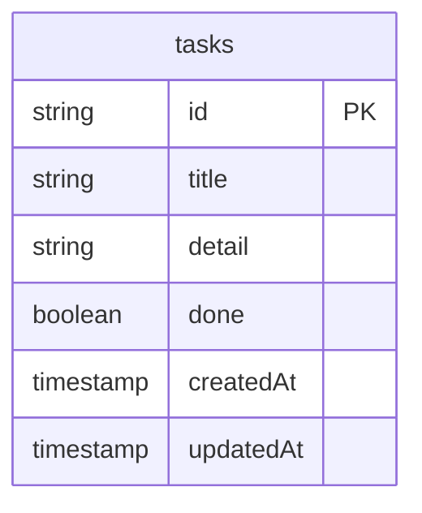

# 要件

## 機能

- タスクを作成できる
- タスクを削除できる
- タスクを達成・未達成に変更できる
- タスク名を変更できる

## 非機能

- ページを訪れたらすぐにタスクを作成できる

# ページ

| ページ名     | URL | できること                         |
| ------------ | --- | ---------------------------------- |
| タスクの一覧 | /   | タスクの一覧表示、作成、更新、削除 |

# DB

